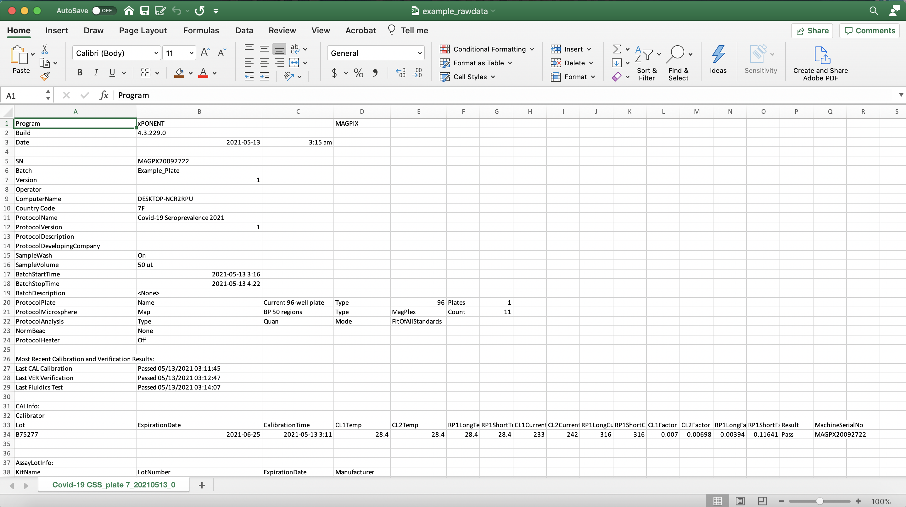
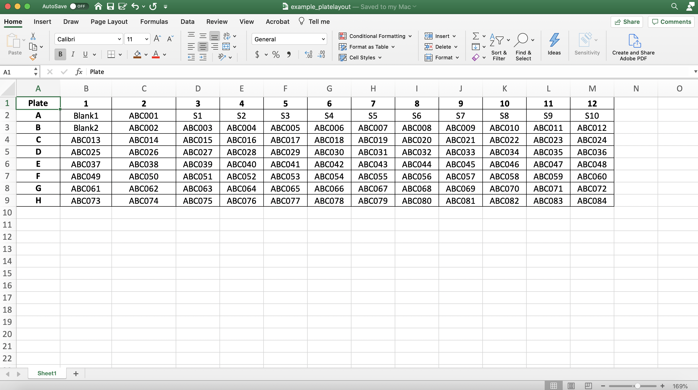
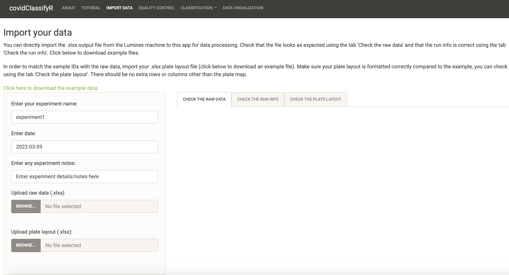
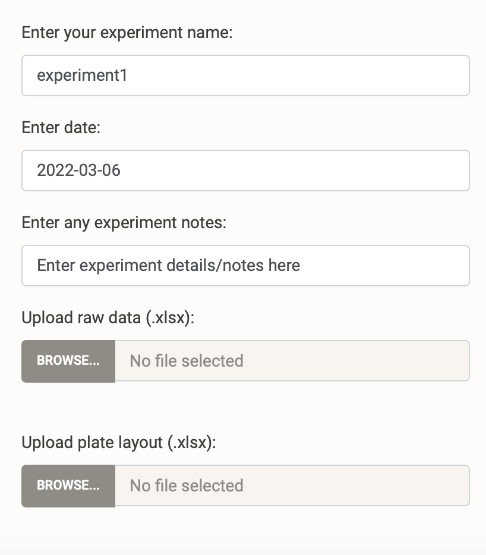
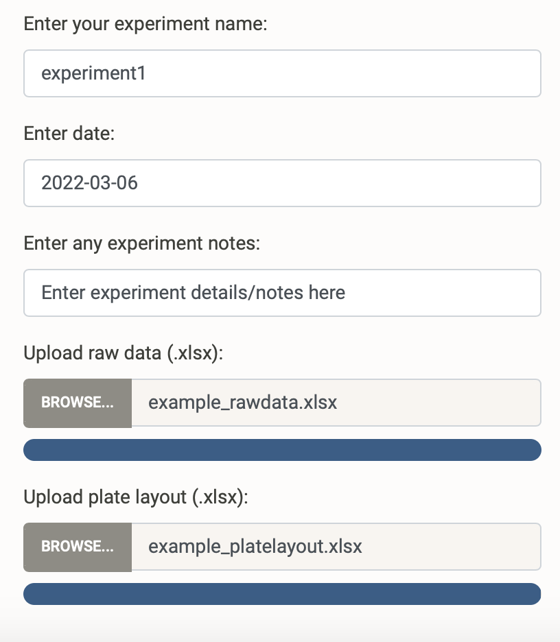
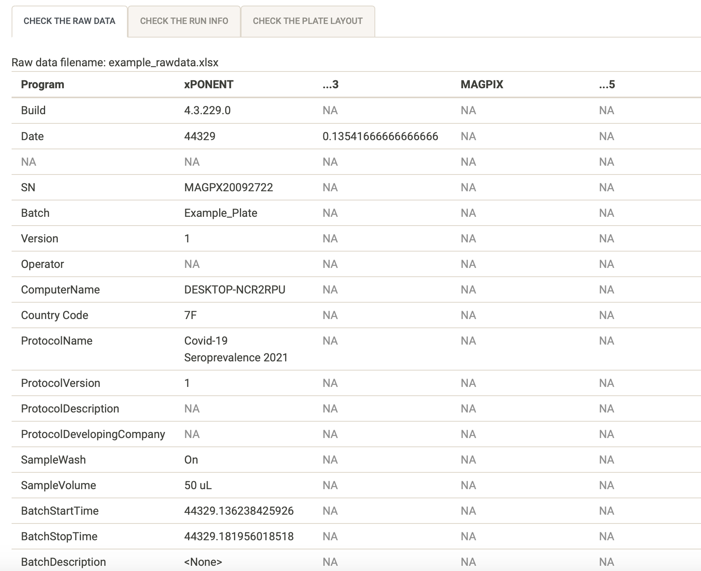
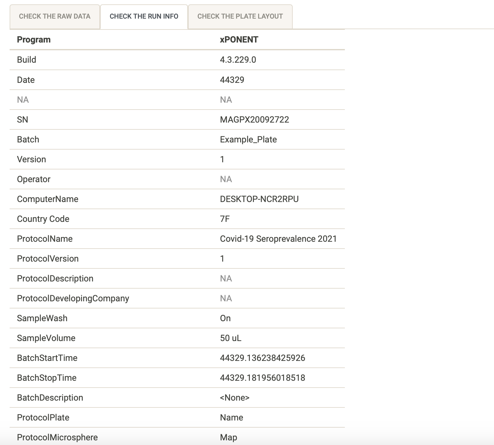
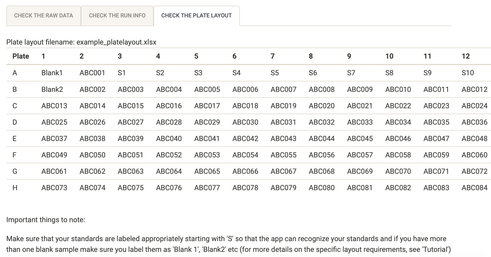

```{r setup, include=FALSE}
options(htmltools.dir.version = FALSE)
knitr::opts_chunk$set(
  fig.width=9, fig.height=3.5, fig.retina=3,
  out.width = "100%",
  cache = FALSE,
  echo = TRUE,
  message = FALSE, 
  warning = FALSE,
  hiline = TRUE
)


library(xaringanthemer)
library(xaringanExtra)
library(showtext)
library(fontawesome)
library(metathis)
library(countdown)
```

```{r xaringan-themer, include=FALSE, warning=FALSE}
style_duo_accent(
  primary_color = "#2372B9",
  secondary_color = "#174a79",
  inverse_header_color = "#FFFFFF",  
  header_color = "#2372B9", 
  code_highlight_color = "#93c54b",
  code_inline_color = "#93c54b",
  text_color = "#3d3d3d", 
  link_color = "#93c54b", 
  inverse_link_color =  "#93c54b",
  header_font_google = google_font("Roboto"),
  text_font_google   = google_font("News Cycle", "300", "300i"),
  code_font_google   = google_font("Fira Mono")
)
```

```{r xaringan-extras, echo=FALSE}
xaringanExtra::use_scribble()
xaringanExtra::use_panelset()
xaringanExtra::use_clipboard()
# xaringanExtra::use_share_again()
xaringanExtra::use_webcam()
xaringanExtra::use_broadcast()
# xaringanExtra::use_progress_bar(color = "blue", location = "bottom")
```

```{r metathis, echo=FALSE}
meta() %>%
  meta_name("github-repo" = "shaziaruybal/covidClassifyR-workshop/slides/session4") %>% 
  meta_social(
    title = "Session 4: Data preparation and how to go from Luminex machine to covidClassifyR Shiny web application",
    description = paste(
      "A four-day workshop on how to use the covidClassifyR Shiny web application",
      "Created for researchers from the Papua New Guinea Institute of Medical Research and partner institutions"
    ),
    url = "https://shaziaruybal.github.io/covidClassifyR-workshop/slides/session4/session4_slides.html",
    image = "https://shaziaruybal.github.io/covidClassifyR-workshop/slides/session4/img/social-share-card.png",
    image_alt = paste(
      "Title slide of Session 4: Data preparation and how to go from Luminex machine to ClassifyR Shiny web application", 
      "created for researchers from the Papua New Guinea Institute of Medical Research and partner institutions"
    ),
    og_type = "website",
    og_author = "Shazia Ruybal-Pesántez",
    twitter_card_type = "summary_large_image",
    twitter_creator = "@DrShaziaRuybal",
    twitter_site = "@DrShaziaRuybal"
  )
```

class: title-slide, middle, left

## `r rmarkdown::metadata$title`

### `r rmarkdown::metadata$author`  
`r rmarkdown::metadata$institute`

`r rmarkdown::metadata$date`

---
class: left

# Recap

--

### `r fontawesome::fa("check-square")` **[Session 1](https://shaziaruybal.github.io/covidClassifyR-workshop/sessions/2022-03-10-session1/index.html)** gave you an overview of the Luminex technology and the COVID-19 multi-antigen serological assay that was established in PNG

--

### `r fontawesome::fa("check-square")` **Session 2** gave you an overview of the purpose of serosurveillance and insights into the COVID-19 sero-surveys that have been carried out in PNG 
--

### `r fontawesome::fa("check-square")` **[Session 3](https://shaziaruybal.github.io/covidClassifyR-workshop/sessions/2022-03-10-session3/index.html)** gave you an overview of the [`covidClassifyR`](https://shaziaruybal.shinyapps.io/covidclassifyr) Shiny app

--

.footnote[
For all the workshop materials see the [workshop website `r fontawesome::fa("external-link-alt")`](https://shaziaruybal.github.io/covidClassifyR-workshop/materials.html) 
]

---

class: center
# `r fontawesome::fa("chalkboard")`
# Today we will cover:

--
### How to prepare your raw data file and plate layout

--
### Do's and dont's

--

### Importing the raw data 

--

### You can find the app [here `r fontawesome::fa("external-link-alt")`](https://shaziaruybal.shinyapps.io/covidClassifyR)

---
class: inverse, middle, center

# `r fontawesome::fa("file-excel")`

## Preparing your data

---
name: data-reqs

# Raw data requirements

#### Your raw data should be exported from the Luminex machine in .xlsx format 

--

#### Make sure that your sample labels in the Luminex machine protocol are as follows:

- **Standards:** labels start with ‘S’ and then a number as required (e.g. S1, S2, S3 or Standard1, Standard2, Standard3)
- **Blanks:** labels start with ‘B’ and then a number as required if there is more than one blank sample (.e.g ‘B1’, ‘B2’, or ‘Blank 1’, ‘Blank2’ etc).
- **Unknown samples:** do not include individual sample labels, leave them as ‘Unknown’

--

**`r fontawesome::fa("lightbulb")` Tip:** Label your antigens the same way in all plate runs. You can do this by setting up the protocol directly on the Luminex machine and using it for all your plate runs.

--

**`r fontawesome::fa("lightbulb")` Tip:** the Shiny app will interpret anything that starts with "S" as a Standard and will use the antibody data from these samples to calculate your standard curve. Similarly, it will interpret anything that starts with "B" as a Blank sample and anything else as an "Unknown".


---
name: plate-reqs

# Plate layout requirements

#### Your plate layout should be in .xlsx format 

--

For each 96-well plate that you run on the Luminex machine, prepare a plate layout that includes the sample labels that will match your raw data. By supplying the plate layout, the Shiny application will match the raw data to the corresponding sample based on the plate layout that you import.

--

Make sure that your sample labels in the plate layout are as follows:

- **Standards:** labels start with ‘S’ and then a number as required (e.g. S1, S2, S3 or Standard1, Standard2, Standard3)
- **Blanks:** labels start with ‘B’ and then a number as required if there is more than one blank sample (.e.g ‘B1’, ‘B2’, or ‘Blank 1’, ‘Blank2’ etc).
- **Unknown samples:** label your unknown samples according to your specific sample codes (e.g. ABC001, ABC002)

--

**`r fontawesome::fa("lightbulb")` Tip:** make sure that there are no extra cells filled out other than the plate wells and sample names.

--

**`r fontawesome::fa("lightbulb")` Tip:** Use the example plate layout as a template to fill in with your sample details.

--

**`r fontawesome::fa("lightbulb")` Tip:** If you haven’t run a full plate, you can leave the wells with no samples completely blank (i.e. no labels).

--

**`r fontawesome::fa("lightbulb")` Tip:** Make sure that the word “Plate” is included in the first column, as the app expects this in order to determine the position of each sample and match it to the raw data outputs.

---
class: inverse, middle, center

# `r fontawesome::fa("file-excel")`

## Download the example data [here `r fontawesome::fa("external-link-alt")`](https://shaziaruybal.shinyapps.io/covidClassifyR/_w_8c7cb1cd/example_data.zip)

---

# `r fa("file-excel")` Example raw data .xlsx



---

# `r fa("file-excel")` Example plate layout .xlsx



---

# `r fa("book-open")` Quiz

--

### `r fa("question-circle")` How do you need to label your standards? 

--

`r fa("check-square")` You need to label them starting with "S" 

--

### `r fa("question-circle")` What would you do if you have more than one blank sample?

--

`r fa("check-square")` Label them with sequential numbers (e.g. Blank1, Blank2, etc)

--

### `r fa("question-circle")` How do you need to label your unknown samples? 

--

`r fa("check-square")` You can use your study codes for each unknown samples

---
class: inverse, middle, center

# `r fa("upload")`
## Importing your data

---

# `r fa("upload")` Importing your data 

.panelset.sideways[
.panel[.panel-name[Navigate to the "Import data" tab]


]

.panel[.panel-name[Experiment info]

.pull-left[
```{r, echo=F, out.height = 400, out.width=350}

```
]

.pull-right[

- Type directly in the text box to change the experiment name that best describes your particular data/Luminex run. For example, you can label it as “MyExperimentName_Plate01”. 
- The analysis date will default to today’s date, but you can modify this by clicking on the date and selecting the date in the calendar. 
- You can also insert experiment notes to provide more details or notes, as necessary. These notes will be displayed on your quality control report when you download it.

**`r fontawesome::fa("lightbulb")` Tip: ** Try to keep your experiment name/filename free of spaces and instead use “_” or “-”. All of your downloadable files (processed data, quality control report, etc) will be labeled as “experiment1_2022-03-06”.
]
]

.panel[.panel-name[Change the experiment info]
<video width="1330" height="410" controls>
  <source src="screen_records/edit_import.mp4" type="video/mp4"> 
</video>
]

.panel[.panel-name[Upload your files]

.pull-left[
```{r, echo=F, out.height = 400, out.width=350}

```
]
.pull-right[
Use the browse button to navigate to your files and upload them. 

**`r fontawesome::fa("lightbulb")` Tip: ** The bar should look blue when the upload is successful. If you get an error, make sure you are uploading .xlsx files.
]]
]

---

# `r fa("magic")` Voila!

<video width="1330" height="410" controls>
  <source src="screen_records/upload_files.mp4" type="video/mp4"> 
</video>

---
# Check the raw data

.pull-left[
### You will notice that the “Check the raw data” tab has populated with a preview of your raw data file. 

`r fa("check-square")` Check whether it looks as expected. You can scroll as needed.

`r fa("check-square")` Check that the raw data file you uploaded was the correct one, by looking at the “Raw data filename” directly under the tab. If it is the wrong one you can click on “Browse” again and upload the correct file.
]

.pull-right[

]
---

# Check the run info

.pull-left[
### You can use the “Check the run info” tab to only look at run specifications and check that they are expected. 

`r fa("check-square")` Check that the Batch, ProtocolName and sample volume are correct and labeled as you expect them to be
]

.pull-right[

]

---
# Check the plate layout

.pull-left[
You can use the “Check the plate layout” tab to make sure the plate layout looks as expected. It is very important to make sure your samples are labeled correctly so that they are interpreted correctly by the app:

- **Standards:** labels start with ‘S’ and then a number as required (e.g. S1, S2, S3 or Standard1, Standard2, Standard3)

- **Blanks:** labels start with ‘B’ and then a number as required if there is more than one blank sample (.e.g ‘B1’, ‘B2’, or ‘Blank 1’, ‘Blank2’ etc).

- **Unknown samples:** label your unknown samples according to your specific sample codes (e.g. ABC001, ABC002)

`r fa("check-square")` Check that the plate layout file you uploaded was the correct one, by looking at the “Plate layout filename” directly under the tab. If it is the wrong one you can click on “Browse” again and upload the correct file.

`r fa("check-square")` Make sure that there are no extra cells filled out other than the plate wells and sample names. 
]

.pull-right[

]
---

# `r fa("laptop-code")` Demo

<video width="1330" height="410" controls>
  <source src="screen_records/import_data_demo.mp4" type="video/mp4"> 
</video>

---

# Acknowledgments

- Dr Maria Ome-Kaius and Dr Fiona Angrisano
- PNGIMR and partner institutions
- WEHI & Burnet Institute
- All of you for attending! 

*We are extremely grateful for financial support to develop and host the covidClassifyR Shiny web application, and to host these virtual workshops through the [Regional Collaborations Programme COVID-19 Digital Grant](https://www.science.org.au/news-and-events/news-and-media-releases/regional-research-set-get-digital-boost) from the Australian Academy of Science and Australian Department of Industry, Science, Energy and Resources.*

The scripts and functions used in [`covidClassifyR`](https://shaziaruybal.shinyapps.io/covidclassifyr) were developed by Shazia Ruybal-Pesántez, with contributions from the following researchers: Eamon Conway, Connie Li Wan Suen, Narimane Nekkab and Michael White.


.footnote[
_These slides were created using the R packages:  
[xaringan](https://github.com/yihui/xaringan), 
[xaringanthemer](https://github.com/gadenbuie/xaringanthemer), 
[xaringanExtra](https://github.com/gadenbuie/xaringanExtra)_ 
]

---
name: contact
class: inverse

.pull-left[
.center[
### Dr Shazia Ruybal-Pesántez 


#### Contact details

[`r fa(name = "envelope")` ruybal.s@wehi.edu.au](mailto:ruybal.s@wehi.edu.au)  
[`r fa(name = "twitter")` @DrShaziaRuybal](https://twitter.com/DrShaziaRuybal)

]]

.pull-right[

### Session 4 Resources:

### [`r icon::fa("youtube")` Recording]()  
### [`r icon::fa("laptop-code")` `covidClassifyR`](https://shaziaruybal.shinyapps.io/covidClassifyR)  
### [`r fontawesome::fa("globe")` Workshop materials](https://shaziaruybal.github.io/covidClassifyR-workshop/materials.html)  
### [`r fontawesome::fa("image")` Slides for Session 4](https://shaziaruybal.github.io/covidClassifyR-workshop/slides/session4/session4_slides.html)
]


---
class: inverse, middle, center

# `r fa("question-circle")` Questions?