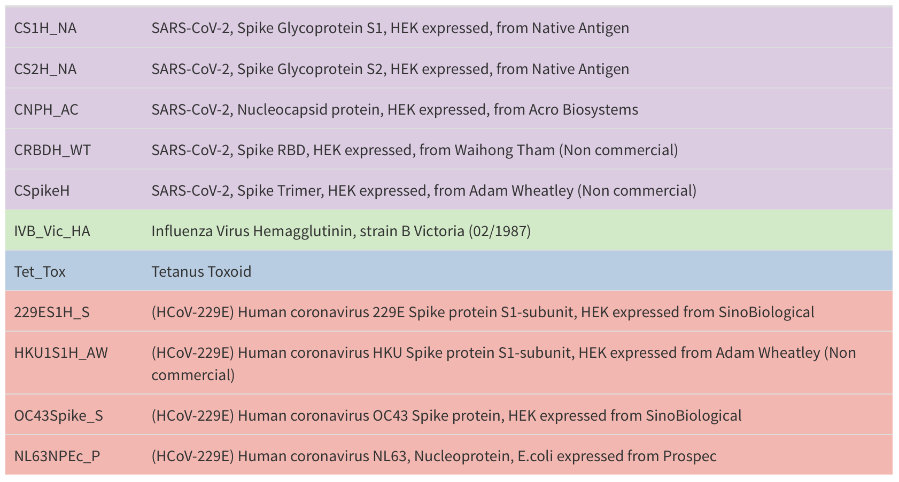
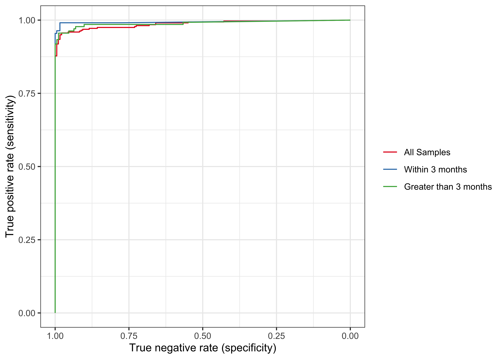

```{r setup, include=FALSE}
options(htmltools.dir.version = FALSE)
knitr::opts_chunk$set(
  fig.width=9, fig.height=3.5, fig.retina=3,
  out.width = "100%",
  cache = FALSE,
  echo = TRUE,
  message = FALSE, 
  warning = FALSE,
  hiline = TRUE
)


library(xaringanthemer)
library(xaringanExtra)
library(showtext)
library(fontawesome)
library(metathis)
library(countdown)
```

```{r xaringan-themer, include=FALSE, warning=FALSE}
style_duo_accent(
  primary_color = "#2372B9",
  secondary_color = "#174a79",
  inverse_header_color = "#FFFFFF",  
  header_color = "#2372B9", 
  code_highlight_color = "#93c54b",
  code_inline_color = "#93c54b",
  text_color = "#3d3d3d", 
  link_color = "#93c54b", 
  inverse_link_color =  "#93c54b",
  header_font_google = google_font("Roboto"),
  text_font_google   = google_font("News Cycle", "300", "300i"),
  code_font_google   = google_font("Fira Mono")
)
```

```{r xaringan-extras, echo=FALSE}
xaringanExtra::use_scribble()
xaringanExtra::use_panelset()
xaringanExtra::use_clipboard()
# xaringanExtra::use_share_again()
xaringanExtra::use_webcam()
xaringanExtra::use_broadcast()
# xaringanExtra::use_progress_bar(color = "blue", location = "bottom")
```

```{r metathis, echo=FALSE}
meta() %>%
  meta_name("github-repo" = "shaziaruybal/covidClassifyR-workshop/slides/session8") %>% 
  meta_social(
    title = "Session 8: Introduction to the COVID-19 classification algorithm",
    description = paste(
      "A four-day workshop on how to use the covidClassifyR Shiny web application",
      "Created for researchers from the Papua New Guinea Institute of Medical Research and partner institutions"
    ),
    url = "https://shaziaruybal.github.io/covidClassifyR-workshop/slides/session8/session8_slides.html",
    image = "https://shaziaruybal.github.io/covidClassifyR-workshop/slides/session8/img/social-share-card.png",
    image_alt = paste(
      "Title slide of Session 8: Introduction to the COVID-19 classification algorithm", 
      "created for researchers from the Papua New Guinea Institute of Medical Research and partner institutions"
    ),
    og_type = "website",
    og_author = "Shazia Ruybal-Pesántez",
    twitter_card_type = "summary_large_image",
    twitter_creator = "@DrShaziaRuybal",
    twitter_site = "@DrShaziaRuybal"
  )
```

class: title-slide, middle, left

## `r rmarkdown::metadata$title`

### `r rmarkdown::metadata$author`  
`r rmarkdown::metadata$institute`

`r rmarkdown::metadata$date`

---
class: left

# Recap

--

#### `r fontawesome::fa("check-square")` **[Session 1](https://shaziaruybal.github.io/covidClassifyR-workshop/sessions/2022-03-10-session1/index.html)** gave you an overview of the Luminex technology and the COVID-19 multi-antigen serological assay that was established in PNG

--

#### `r fontawesome::fa("check-square")` **[Session 2](https://shaziaruybal.github.io/covidClassifyR-workshop/sessions/2022-03-10-session2/index.html)** gave you an overview of the purpose of serosurveillance and insights into the COVID-19 sero-surveys that have been carried out in PNG 
--

#### `r fontawesome::fa("check-square")` **[Session 3](https://shaziaruybal.github.io/covidClassifyR-workshop/sessions/2022-03-10-session3/index.html)** gave you an overview of the [`covidClassifyR`](https://shaziaruybal.shinyapps.io/covidclassifyr) Shiny app

--

#### `r fontawesome::fa("check-square")` **[Session 4](https://shaziaruybal.github.io/covidClassifyR-workshop/sessions/2022-03-11-session4/index.html)** gave you an overview of how to prepare and import your data to the [`covidClassifyR`](https://shaziaruybal.shinyapps.io/covidclassifyr) Shiny app

--

#### `r fontawesome::fa("check-square")` **[Session 5](https://shaziaruybal.github.io/covidClassifyR-workshop/sessions/2022-03-11-session5/index.html)** gave you an overview of how to prepare your data and upload your data to the [`covidClassifyR`](https://shaziaruybal.shinyapps.io/covidclassifyr) app, and how to check the Luminex run info, raw data file and user-supplied plate layout

--

#### `r fontawesome::fa("check-square")` **[Session 6](https://shaziaruybal.github.io/covidClassifyR-workshop/sessions/2022-03-11-session6/index.html)** gave you an overview of how to download your processed data and quality control report

--

#### `r fontawesome::fa("check-square")` **[Session 7](https://shaziaruybal.github.io/covidClassifyR-workshop/sessions/2022-03-17-session7/index.html)** gave a recap of how to QC your data

--

.footnote[
For all the workshop materials see the [workshop website `r fontawesome::fa("external-link-alt")`](https://shaziaruybal.github.io/covidClassifyR-workshop/materials.html) 
]

---

class: center
# `r fontawesome::fa("chalkboard")`
# Today we will cover:

--
### The development of the COVID-19 classification algorithm

--
### The samples used to train the algorithm

--

### The performance of the classification algorithm

--

### You can find the app [here `r fontawesome::fa("external-link-alt")`](https://shaziaruybal.shinyapps.io/covidClassifyR)

---
class: inverse
# Why do we need a classification algorithm?

--
- #### Our multi-antigen SARS-CoV-2 panel was developed for research purposes as a serological tool that can detect individuals with past exposure to SARS-CoV-2 without the need for knowledge of previous exposure *a priori*

--
- #### By multiplexing several SARS-CoV-2 antigens and other viral antigens in our panel, we can simultaneously measure the presence of IgG antibodies to all these antigens for each patient sample with unknown exposure

--
- #### The antibody measurements to the entire antigen panel are best interpreted together instead of individually, so we need advanced statistical methods that consider the combined "serological signature". This serological signature considers antibodies to SARS-CoV-2 but also to other viruses (e.g. Influenza, seasonal human coronaviruses)      

--
- #### Machine learning algorithms such as random forest algorithms can be "trained" to predict exposure and robustly classify samples as recently exposed or not recently exposed to SARS-CoV-2 

--
- #### The random forest algorithm also "learns" what the serological signature to other viruses (e.g. Influenza, seasonal human coronaviruses) looks like, so that the samples from individuals exposed to other viruses (but not SARS-CoV-2) are not misclassified

---

# `r fa("network-wired")` What is a Random Forest machine learning algorithm?

.pull-left[

### Let's start with a simple example: how do you decide which mode of transport you will take to work? 

#### E.g. if I walk it will take me exactly 30 mins, but if I take the bus I could get there in 15 mins - but if the bus is late I will not make it in time. If the bus is late, it will be best for me to take a taxi and I will be there in 10 mins.

]

.pull-right[

]

---
class: inverse, middle, center

# `r fa("network-wired")` Can you think of some examples of "decision trees"?


---
background-image: url("img/eg_decisiontree.jpeg")
background-position: right center
background-size: 50%

# `r fa("network-wired")` What is a Random Forest machine learning algorithm?

.pull-left[

- #### Decision trees form the basis of the random forest algorithm. Each decision tree results in a prediction. 

- #### This example has 3 classes (or groups). If we want to "train" someone to correctly them by **color** and **underlined/not underlined**, how would you do this?


.footenote[
.bottom[
_[Resource `r fontawesome::fa("external-link-alt")`](https://towardsdatascience.com/understanding-random-forest-58381e0602d2)_
]]
]

---
# `r fa("network-wired")` Our COVID-19 random forest classification algorithm

--
- #### The features from all 11 antigens are used to train the RF algorithm (presence and level of IgG antibodies become our "colors" and "underlined" features)

--
- #### We train the RF algorithm using samples that we know have been exposed to SARS-CoV-2, so it learns what a "positive" sample antibody profile looks like

--
- #### We train the RF algorithm using samples that we know have **not** been exposed to SARS-CoV-2, so it learns what a "negative" sample antibody profile looks like

---

# The samples used to train the PNG algorithm

.pull-left[
### SARS-CoV-2 positive samples

- SARS-CoV-2 positive samples from four independent Melbourne studies (including COVID-PROFILE at WEHI*)
  - days post symptom onset: median = 54 days, range = 0 - 185 days

.footnote[
.bottom[
_* note that for the Melbourne algorithm included in the [`covidClassifyR`](https://shaziaruybal.shinyapps.io/covidclassifyr) app, the COVID-PROFILE samples were excluded from the training dataset. Therefore, the Melbourne algorithm should be used if processing samples run using the Melbourne Luminex assay. _
]
]
]

.pull-right[
### SARS-CoV-2 negative samples

- Negative pre-pandemic controls from several Melbourne studies, Australian Red Cross and Volunteer Blood Donor Registry at WEHI
- Possibly cross-reactive samples (e.g. seasonal human coronaviruses)
]
---

# The antigens

```{r echo=F, out.height=500, out.width=900}

```

---

# Classifiers

### Before training the random forest, we divided the data set into three separate categories.

--

#### **Classifier 1:** All positive and negative samples in the data set
#### **Classifier 2:** Negative controls and positive samples that were more than two weeks but up to three months post symptom onset
#### **Classifier 3:** Negative controls and positive samples whose symptom onset was between three and six months

--

- _For each random forest classifier, a random sample containing two thirds of the data was used for training, with the remainder of the data set being used for validation_

--

- _The built-in algorithm in the Shiny app predicts exposure using all three classifiers resulting in three predictions of exposure status for each sample_

---

# Performance

.pull-left[

]

.pull-right[

The sensitivity and specificity of each classifier was >90%. 

| **Classifier**   | **Details**                                                                                                    | **Sensitivity** | **Specificity** |
|------------------|----------------------------------------------------------------------------------------------------------------|-----------------|-----------------|
| **Classifier 1** *(red)* | All samples in the data set                                                              | 93.98%          | 94.12%          |
| **Classifier 2** *(blue)* | Negative controls and positive samples >2 weeks to ≤3 months post symptom onset | 98.51%          | 100%            |
| **Classifier 3** *(green)* | Negative controls and positive samples between 3-6 months  post sympton onset                  | 93.44%          | 97.87%          |

]

---
class: inverse, middle, center

# `r fontawesome::fa("clipboard-check")`

## Next session:

### How to apply the classification algorithm to your data

---

# Acknowledgments

- Dr Maria Ome-Kaius and Dr Fiona Angrisano
- PNGIMR and partner institutions
- WEHI & Burnet Institute
- All of you for attending! 

*We are extremely grateful for financial support to develop and host the covidClassifyR Shiny web application, and to host these virtual workshops through the [Regional Collaborations Programme COVID-19 Digital Grant](https://www.science.org.au/news-and-events/news-and-media-releases/regional-research-set-get-digital-boost) from the Australian Academy of Science and Australian Department of Industry, Science, Energy and Resources.*

The scripts and functions used in [`covidClassifyR`](https://shaziaruybal.shinyapps.io/covidclassifyr) were developed by Shazia Ruybal-Pesántez, with contributions from the following researchers: Eamon Conway, Connie Li Wan Suen, Narimane Nekkab and Michael White.


.footnote[
_These slides were created using the R packages:  
[xaringan](https://github.com/yihui/xaringan), 
[xaringanthemer](https://github.com/gadenbuie/xaringanthemer), 
[xaringanExtra](https://github.com/gadenbuie/xaringanExtra)_ 
]

---
name: contact
class: inverse

.pull-left[
.center[
### Dr Shazia Ruybal-Pesántez 


#### Contact details

[`r fa(name = "envelope")` ruybal.s@wehi.edu.au](mailto:ruybal.s@wehi.edu.au)  
[`r fa(name = "twitter")` @DrShaziaRuybal](https://twitter.com/DrShaziaRuybal)

]]

.pull-right[

### Session 8 Resources:

### [`r icon::fa("youtube")` Recording]()  
### [`r icon::fa("laptop-code")` `covidClassifyR`](https://shaziaruybal.shinyapps.io/covidClassifyR)  
### [`r fontawesome::fa("globe")` Workshop materials](https://shaziaruybal.github.io/covidClassifyR-workshop/materials.html)  
### [`r fontawesome::fa("image")` Slides for Session 8](https://shaziaruybal.github.io/covidClassifyR-workshop/slides/session7/session8_slides.html)
]


---
class: inverse, middle, center

# `r fa("question-circle")` Questions?