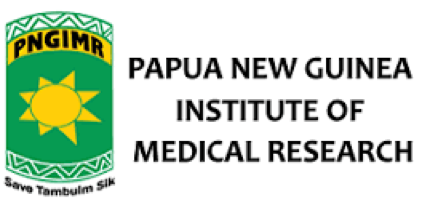

```{r setup, include=FALSE}
knitr::opts_chunk$set(echo = FALSE)

# Learn more about creating websites with Distill at:
# https://rstudio.github.io/distill/website.html

# Learn more about publishing to GitHub Pages at:
# https://rstudio.github.io/distill/publish_website.html#github-pages

library(metathis)
```

```{r meta}
meta() %>%
  meta_general(
    description = "Workshop on how to use the covidClassifyR Shiny web application for researchers from PNGIMR and partner institutions",
    generator = "xaringan and remark.js"
  ) %>% 
  meta_name("github-repo" = "shaziaruybal/covidClassifyR-workshop") %>% 
  meta_social(
    title = "Workshop on how to use the covidClassifyR Shiny application",
    url = "https://shaziaruybal.github.io/covidClassifyR-workshop/",
    image = "https://shaziaruybal.github.io/covidClassifyR-workshop/images/app_screenshot.png",
    image_alt = paste(
      "Screenshot of covidClassifyR Shiny Web application workshop"),
    og_type = "website",
    og_author = "Shazia Ruybal-Pesántez",
    twitter_card_type = "summary_large_image",
    twitter_creator = "@DrShaziaRuybal"
  )
```

# Welcome
This is the website for all the materials needed for the four-day workshop to train scientific research officers on how to use the [`covidClassifyR`](https://shaziaruybal.shinyapps.io/covidclassifyr) Shiny web application led by Dr. Shazia Ruybal-Pesántez, Dr. Maria Ome-Kaius and Dr. Fiona Angrisano for researchers from the Papua New Guinea Institute of Medical Research and partner institutions. Meet your instructors [here](instructors.html). Funding for the development of [`covidClassifyR`](https://shaziaruybal.shinyapps.io/covidclassifyr) and the related training workshops for PNGIMR researchers was generously provided by a [Regional Collaborations Programme COVID-19 Digital Grant](https://www.science.org.au/news-and-events/news-and-media-releases/regional-research-set-get-digital-boost) from the Australian Academy of Science and Australian Department of Industry, Science, Energy and Resources.

<aside>
```{r, out.height=60}

```

```{r, out.height=40}

```

```{r, out.width=90}

```
</aside>

# Overview
In this four-day workshop you will learn about the data generated using the COVID-19 serology laboratory assay (also described in [Mazhari et al 2021](https://doi.org/10.3390/mps4040072)), the COVID-19 serological surveys that have been carried out by PNGIMR, and an overview of how to use the [`covidClassifyR`](https://shaziaruybal.shinyapps.io/covidclassifyr) Shiny application to process and analyse data to support COVID-19 research efforts. This workshop will be held via Zoom and in-person at PNGIMR Port Moresby and Goroka offices. Data packages for connectivity during the workshops and for use when using the Shiny application will be provided to all participants. 

# Schedule
- **Day 1:** 

  - [Session 1](sessions/2022-03-10-session1/index.html): Introduction to the SARS-CoV-2 Luminex multi-antigen serology assay
  - [Session 2](sessions/2022-03-10-session2/index.html): Introduction to the COVID-19 serological surveys that have been conducted in PNG
  - [Session 3](sessions/2022-03-10-session3/index.html): Introduction to the [`covidClassifyR`](https://shaziaruybal.shinyapps.io/covidclassifyr) Shiny application
  
<aside>
**Day 1 leaders:** <br/> Dr Angrisano, Dr Ome-Kaius, Dr Ruybal-Pesántez <br/><br/>
**Date:** <br/> Thursday, 10th March 2022 <br/> 8:30-11:30am GMT+10
</aside>

- **Day 2:** 

  - [Session 4](sessions/2022-03-11-session4/index.html): Data preparation and how to go from Luminex machine to [`covidClassifyR`](https://shaziaruybal.shinyapps.io/covidclassifyr) app
  - [Session 5](sessions/2022-03-11-session5/index.html): How to perform quality control of your data 
  - [Session 6](sessions/2022-03-11-session6/index.html): Download your quality control report and processed data
  
<aside>
**Day 2 leaders:** <br/> Dr Ruybal-Pesántez <br/><br/>
**Date:** <br/> Friday, 11th March 2022 <br/> 8:30-11:30am GMT+10
</aside>

- **Day 3:** 

  - [Session 7](sessions/2022-03-17-session7/index.html): Recap of how to perform quality control of your data 
  - [Session 8](sessions/2022-03-17-session8/index.html): Introduction to the COVID-19 classification algorithm
  - Session 9: How to apply the classification algorithm to your data
  
<aside>
**Day 3 leaders:** <br/> Dr Ruybal-Pesántez <br/><br/>
**Date:** <br/> Thursday, 17th March 2022 <br/> 8:30-11:30am GMT+10
</aside>

- **Day 4:** 

  - Session 10: Recap of data QC and classification
  - Session 11: How to visualize your data in the [`covidClassifyR`](https://shaziaruybal.shinyapps.io/covidclassifyr) app
  - Session 12: Bring your own data to work on
  
<aside>
**Day 4 leaders:** <br/> Dr Ruybal-Pesántez <br/><br/>
**Date:** <br/> Thursday, 24th March 2022 <br/> 8:30-11:30am GMT+10
</aside>

# About the [`covidClassifyR`](https://shaziaruybal.shinyapps.io/covidclassifyr) app
This fit-for-purpose analytical tool was developed to streamline the processing of serological data generated using a validated high-throughput multiplex serological assay for measuring antibodies to SARS-CoV-2 (Mazhari et al 2021). This tool also aims to make the downstream processing, quality control and interpretation of the raw data generated from this serological assay accessible to all researchers without the need for a specialist background in statistical methods and advanced programming. 

You can access the [`covidClassifyR`](https://shaziaruybal.shinyapps.io/covidclassifyr) Shiny web application [here](https://shaziaruybal.shinyapps.io/covidclassifyr).

A tutorial for how to use the application can be accessed [here](https://shaziaruybal.shinyapps.io/covidclassifyr) via the "Tutorial" tab.

# Before you start
You are welcome to take a look at the [`covidClassifyR`](https://shaziaruybal.shinyapps.io/covidclassifyr) app before the workshop and/or the [`covidClassifyR` tutorial](https://shaziaruybal.shinyapps.io/covidclassifyr).

You will need:

- laptop with internet connection
  - Please check that the [`covidClassifyR`](https://shaziaruybal.shinyapps.io/covidclassifyr) app loads on your browser

# Workshop materials
All of the slides and session materials can be found in [here](materials.html). 

# Acknowledgments {.appendix}

This workshop was designed for researchers from the Papua New Guinea Institute for Medical Research and partner institutions, and led by Dr. Shazia Ruybal-Pesántez, Dr. Maria Ome-Kaius and Dr. Fiona Angrisano. 

Funding for this workshop was provided by a [Regional Collaborations Programme COVID-19 Digital Grant](https://www.science.org.au/news-and-events/news-and-media-releases/regional-research-set-get-digital-boost) from the Australian Academy of Science and Australian Department of Industry, Science, Energy and Resources. 

This website was made with the [distill package](https://rstudio.github.io/distill/) by [Dr Shazia Ruybal-Pesántez](https://shaziaruybal.com).