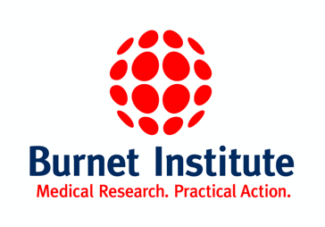

```{r setup, include=FALSE}
knitr::opts_chunk$set(echo = FALSE)

# Learn more about creating websites with Distill at:
# https://rstudio.github.io/distill/website.html

# Learn more about publishing to GitHub Pages at:
# https://rstudio.github.io/distill/publish_website.html#github-pages

library(metathis)
```

```{r meta}
meta() %>%
  meta_general(
    description = "Workshop on how to use the covidClassifyR Shiny web application",
    generator = "xaringan and remark.js"
  ) %>% 
  meta_name("github-repo" = "shaziaruybal/covidclassifyr-workshop") %>% 
  meta_social(
    title = "How to use the covidClassifyR Shiny application workshop",
    url = "https://shaziaruybal.github.io/covidclassifyr-workshop",
    image = "",
    image_alt = paste(
      "Title slide of covidClassifyR Shiny Web application workshop"),
    og_type = "website",
    og_author = "Shazia Ruybal-Pesántez",
    twitter_card_type = "summary_large_image",
    twitter_creator = "@DrShaziaRuybal"
  )
```

# Welcome
This is the website for all the materials needed for the four-session workshop to train scientific research officers on how to use the [`covidClassifyR`](https://shaziaruybal.shinyapps.io/covidclassifyr) Shiny web application created by Dr. Shazia Ruybal-Pesántez, Dr. Maria Ome-Kaius and Dr. Fiona Angrisano for the Papua New Guinea Institute of Medical Research. Funding for the development of [`covidClassifyR`](https://shaziaruybal.shinyapps.io/covidclassifyr) and the related training workshops for PNGIMR researchers was generously provided by a [Regional Collaborations Programme COVID-19 Digital Grant](https://www.science.org.au/news-and-events/news-and-media-releases/regional-research-set-get-digital-boost) from the Australian Academy of Science and Australian Department of Industry, Science, Energy and Resources.

<aside>
```{r, out.height=60}

```

```{r, out.height=45}

```

```{r, out.width=90}

```
</aside>

# Overview
This workshop has four sessions where you will learn about the data generated using the COVID-19 serology laboratory assay (also described in [Mazhari et al 2021](https://doi.org/10.3390/mps4040072)), the COVID-19 serological surveys that have been carried out by PNGIMR, and an overview of how to use the [`covidClassifyR`](https://shaziaruybal.shinyapps.io/covidclassifyr) Shiny application to process and analyse data to support COVID-19 research efforts. This workshop will be held via Zoom and in-person at PNGIMR Port Moresby and Goroka offices. Data packages for connectivity during the workshops and for use when using the Shiny application will be provided to all participants.

- **Session 1:** 

  - Topic 1: Introduction to the SARS-CoV-2 Luminex multi-antigen serology assay
  - Topic 2: Introduction to the COVID-19 serological surveys that have been conducted in PNG
  - Topic 3: Data preparation and how to go from Luminex machine to Shiny app
  
<aside>
**Session 1 leaders:** <br/> Dr Angrisano, Dr Ome-Kaius, Dr Ruybal-Pesántez <br/><br/>
**Date:** <br/> Thursday, 10th March 2022 <br/> 8:30-11:30am GMT+10
</aside>

- **Session 2:** 

  - Topic 1: Importing your data to the [`covidClassifyR`](https://shaziaruybal.shinyapps.io/covidclassifyr) app
  - Topic 2: How to perform quality control of your data 
  - Topic 3: Generate your quality control report and look at your processed data
  
<aside>
**Session 2 leaders:** <br/> Dr Ruybal-Pesántez <br/><br/>
**Date:** <br/> Friday, 11th March 2022 <br/> 8:30-11:30am GMT+10
</aside>

- **Session 3:** 

  - Topic 1: Recap of how to perform quality control of your data 
  - Topic 2: Introduction to the COVID-19 classification algorithm
  - Topic 3: How to apply the classification algorithm to your data
  
<aside>
**Session 3 leaders:** <br/> Dr Ruybal-Pesántez <br/><br/>
**Date:** <br/> Thursday, 17th March 2022 <br/> 8:30-11:30am GMT+10
</aside>

- **Session 4:** 

  - Topic 1: Recap of data QC and classification
  - Topic 2: How to visualize your data in the [`covidClassifyR`](https://shaziaruybal.shinyapps.io/covidclassifyr) app
  - Topic 3: Bring your own data to work on
  
<aside>
**Session 4 leaders:** <br/> Dr Ruybal-Pesántez <br/><br/>
**Date:** <br/> Thursday, 24th March 2022 <br/> 8:30-11:30am GMT+10
</aside>

# Before you start
REQUIREMENTS? Laptop, data package (to be provided)

# Workshop materials
You can access all the slides and session materials [here](#materials)

# Acknowledgments {.appendix}

This workshop was designed for Papua New Guinea Institute for Medical Research researchers and led by Dr. Shazia Ruybal-Pesántez, Dr. Maria Ome-Kaius and Dr. Fiona Angrisano. 

Funding for this workshop was provided by a [Regional Collaborations Programme COVID-19 Digital Grant](https://www.science.org.au/news-and-events/news-and-media-releases/regional-research-set-get-digital-boost) from the Australian Academy of Science and Australian Department of Industry, Science, Energy and Resources. 

This website was made with the [distill package](https://rstudio.github.io/distill/) by [Dr Shazia Ruybal-Pesántez](https://shaziaruybal.com).