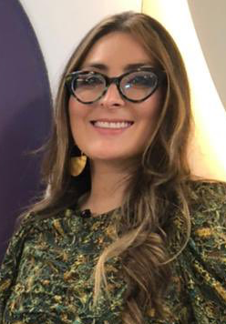

**Fiona Angrisano, PhD**

Fiona is a [Senior Research Officer at Burnet Institute](https://www.burnet.edu.au/people/697_fiona_angrisano) in Melbourne, Australia. She has worked closely with the PNGIMR teams to establish the COVID-19 multi-antigen Luminex serology assay at the Molecular Hub in Port Moresby. Fiona will be leading [Session 1](sessions/2022-03-10-session1/index.html). 

<aside>
{width=100% height=80%}
**Contact:** fiona.angrisano@burnet.edu.au
</aside>

**Maria Ome-Kaius, MD PhD**

Maria is a Senior Research Clinician at the Vector-Borne Disease Unit at the Papua New Guinea Institute of Medical Research in PNG. She leads the COVID-19 serological surveys that have been conducted in PNG. Maria will be leading [Session 2](sessions/2022-03-10-session2/index.html). 

<aside>
{width=100% height=90%}

**Contact:** maria.ome@pngimr.org.pg
</aside>

**Shazia Ruybal-Pesántez, PhD**

Shazia is a [Research Officer at Walter and Eliza Hall Institute of Medical Research and Burnet Institute](https://www.burnet.edu.au/people/701_shazia_ruybal) in Melbourne, Australia. She developed the [`covidClassifyR`](https://shaziaruybal.shinyapps.io/covidclassifyr) Shiny application and has supported the PNGIMR teams with COVID-19 data analysis. Shazia will be leading [Session 3](sessions/2022-03-10-session3/index.html) and Sessions 4-12. 

<aside>
{width=100% }

**Contact:** ruybal.s@wehi.edu.au
</aside>