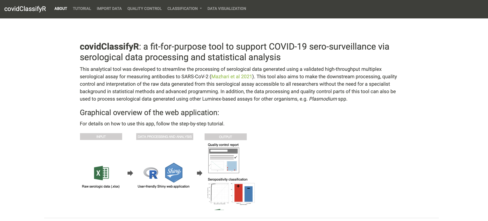
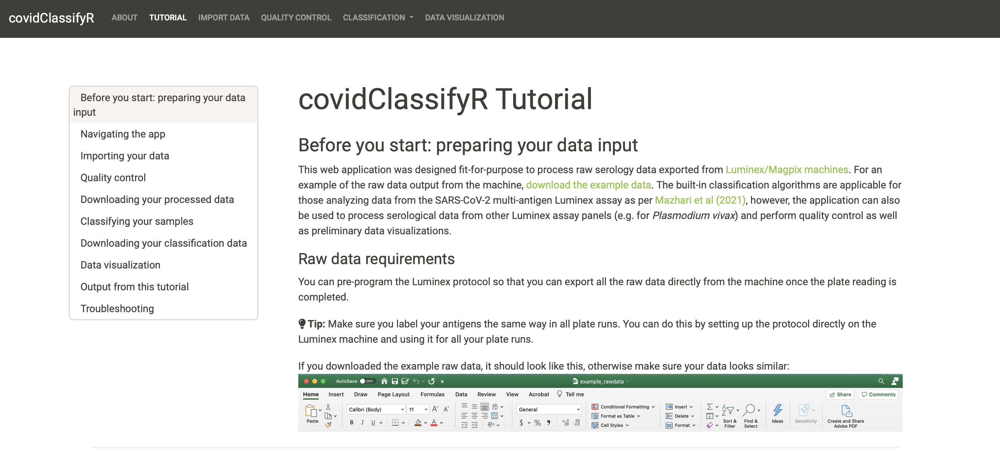
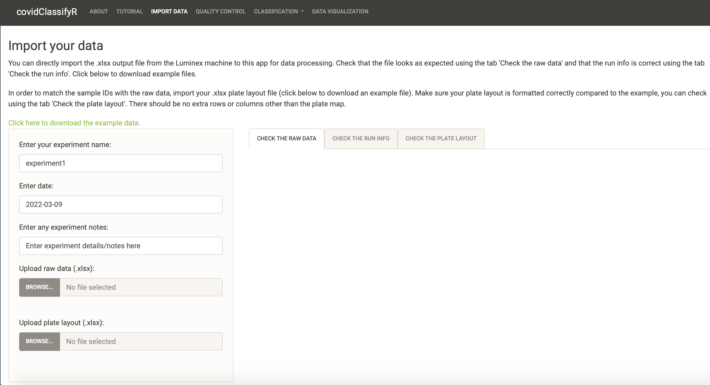
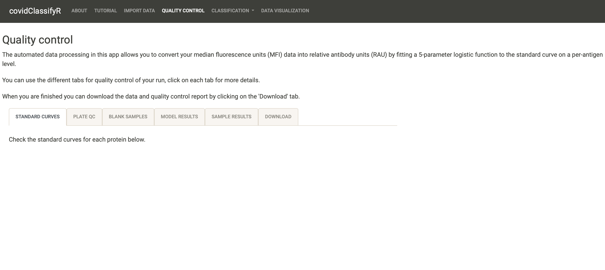
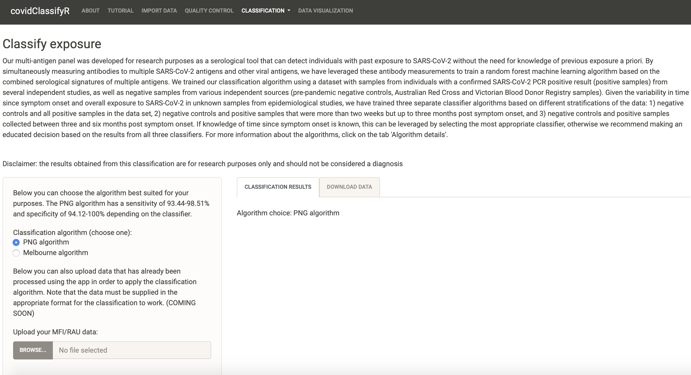
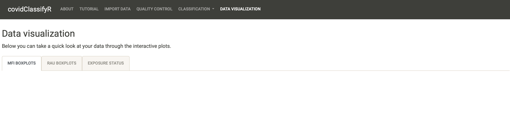

```{r setup, include=FALSE}
options(htmltools.dir.version = FALSE)
knitr::opts_chunk$set(
  fig.width=9, fig.height=3.5, fig.retina=3,
  out.width = "100%",
  cache = FALSE,
  echo = TRUE,
  message = FALSE, 
  warning = FALSE,
  hiline = TRUE
)

library(xaringanthemer)
library(xaringanExtra)
library(showtext)
library(fontawesome)
library(metathis)
library(countdown)
```

```{r xaringan-themer, include=FALSE, warning=FALSE}
# style_duo_accent(
#   primary_color = "#1381B0",
#   secondary_color = "#1c5253",
#   link_color = "#8d9393",
#   inverse_header_color = "#FFFFFF"
# )

style_duo_accent(
  primary_color = "#2372B9",
  secondary_color = "#174a79",
  inverse_header_color = "#FFFFFF",  
  header_color = "#2372B9", 
  code_highlight_color = "#93c54b",
  code_inline_color = "#93c54b",
  text_color = "#3d3d3d", 
  link_color = "#93c54b", 
  inverse_link_color =  "#93c54b",
  header_font_google = google_font("Roboto"),
  text_font_google   = google_font("News Cycle", "300", "300i"),
  code_font_google   = google_font("Fira Mono")
)
```

```{r xaringan-extras, echo=FALSE}
xaringanExtra::use_scribble()
xaringanExtra::use_panelset()
xaringanExtra::use_clipboard()
# xaringanExtra::use_share_again()
xaringanExtra::use_webcam()
xaringanExtra::use_broadcast()
# xaringanExtra::use_progress_bar(color = "blue", location = "bottom")
```

```{r metathis, echo=FALSE}
meta() %>%
  meta_name("github-repo" = "shaziaruybal/covidClassifyR-workshop/slides/session3") %>% 
  meta_social(
    title = "Session 3: Introduction to the covidClassifyR Shiny web application",
    description = paste(
      "A four-day workshop on how to use the covidClassifyR Shiny web application",
      "Created for researchers from the Papua New Guinea Institute of Medical Research and partner institutions"
    ),
    url = "https://shaziaruybal.github.io/covidClassifyR-workshop/slides/session3/session3_slides.html",
    image = "https://shaziaruybal.github.io/covidClassifyR-workshop/slides/session3/img/social-share-card.png",
    image_alt = paste(
      "Title slide of Session 3: Introduction to the covidClassifyR Shiny web application", 
      "created for researchers from the Papua New Guinea Institute of Medical Research and partner institutions"
    ),
    og_type = "website",
    og_author = "Shazia Ruybal-Pesántez",
    twitter_card_type = "summary_large_image",
    twitter_creator = "@DrShaziaRuybal",
    twitter_site = "@DrShaziaRuybal"
  )
```

class: title-slide, middle, left

## `r rmarkdown::metadata$title`

### `r rmarkdown::metadata$author`  
`r rmarkdown::metadata$institute`

`r rmarkdown::metadata$date`

---
class: left

# Recap

### `r fontawesome::fa("check-square")` **Session 1** gave you an overview of the Luminex technology and the COVID-19 multi-antigen serological assay that was established in PNG

--

### `r fontawesome::fa("check-square")` **Session 2** gave you an overview of the purpose of serosurveillance and insights into the COVID-19 sero-surveys that have been carried out in PNG 

--

.footnote[
For the materials for sessions 1 and 2 see the [workshop website `r fontawesome::fa("external-link-alt")`](https://shaziaruybal.github.io/covidClassifyR-workshop/) 
]
---

class: center
# `r fontawesome::fa("chalkboard")`
# Today we will cover:

--
### An intro to the [`covidClassifyR`](https://shaziaruybal.shinyapps.io/covidclassifyr) Shiny web application

--
### Why it was developed

--

### The features in the application

--

### You can find the app [here `r fontawesome::fa("external-link-alt")`](https://shaziaruybal.shinyapps.io/covidClassifyR)

---
class: inverse
# Why was [`covidClassifyR`](https://shaziaruybal.shinyapps.io/covidclassifyr) developed?

--

- #### Quality control of Luminex data needs to be performed for each plate that is run and should be performed in real-time

--

- #### Processing the Luminex data requires customized scripts 

--

- #### Algorithms that enable the classification of unknown samples into those that are predicted to have had recent exposure to SARS-CoV-2 or no recent exposure require advanced statistical and programming skills

--

- #### Fit-for-purpose tools are required to make such data processing pipelines and advanced analyses accessible to researchers regardless of their statistical/programming background

--

- #### Automated data processing pipelines can decrease time spent on manual tasks, reduce human error and can empower researchers to focus on the analysis and interpretation of their data rather than manual processing

---
class: inverse, middle, center

# `r fontawesome::fa("laptop-code")`

## [`covidClassifyR`](https://shaziaruybal.shinyapps.io/covidclassifyr) was developed fit-for-purpose to streamline the processing of serological data generated using the COVID-19 multi-antigen serological assay

---
class: inverse

## [`covidClassifyR`](https://shaziaruybal.shinyapps.io/covidclassifyr) allows you to:

--

### `r fontawesome::fa("file-excel")` process your Luminex raw data 

--

### `r fontawesome::fa("clipboard")` perform quality control of your data and generate a quality control report

--

### `r fontawesome::fa("question-circle")` apply the built-in classification algorithms to predict exposure to COVID-19 based on the antibody data

--

### `r fontawesome::fa("chart-bar")` visualize your data with built-in interactive plots

--

### `r fontawesome::fa("download")` download your processed data for further downstream analysis

---

# Navigating the app



---

# Tutorial
You can check out the tutorial [here `r fontawesome::fa("external-link-alt")`](https://shaziaruybal.shinyapps.io/covidclassifyr) and click on the "Tutorial" tab. You can download the example data and try it yourself! 



---

# Importing your data
We will cover how to prepare and import your data in [Session 4](https://shaziaruybal.github.io/covidClassifyR-workshop/materials.html)


---
# Quality control
We will cover how to QC your data in [Session 5](https://shaziaruybal.github.io/covidClassifyR-workshop/materials.html), and how to generate your QC report and look at your processed data in [Session 6](https://shaziaruybal.github.io/covidClassifyR-workshop/materials.html)


---

# Classification
We will cover the built-in classification algorithms in [Session 8](https://shaziaruybal.github.io/covidClassifyR-workshop/materials.html) and how to apply them to your data in [Session 9](https://shaziaruybal.github.io/covidClassifyR-workshop/materials.html)



---

# Data visualization
We will cover how to interpet and visualize your data using the built-in interactive plots in [Session 11](https://shaziaruybal.github.io/covidClassifyR-workshop/materials.html) 



---
class: left

# `r fontawesome::fa("user-clock")` Your turn

Go to the [`covidClassifyR`](https://shaziaruybal.shinyapps.io/covidclassifyr) Shiny web application by clicking [here `r fontawesome::fa("external-link-alt")`](https://shaziaruybal.shinyapps.io/covidclassifyr).


```{r echo = FALSE}
countdown(minutes = 5)
```

---
# `r fontawesome::fa("book-open")` Your homework for next time

--

### `r fontawesome::fa("check-square")` Access the [`covidClassifyR`](https://shaziaruybal.shinyapps.io/covidclassifyr) Shiny web application [`r fontawesome::fa("external-link-alt")`](https://shaziaruybal.shinyapps.io/covidclassifyr)

--

### `r fontawesome::fa("check-square")` Download the example data

--

### `r fontawesome::fa("check-square")` Take a look at the example raw data and plate layout files 

--


#### `r fontawesome::fa("star")` Bonus: using the tutorial as a guide, try and follow along how to import the example data 

---

# Acknowledgments

- Dr Maria Ome-Kaius and Dr Fiona Angrisano
- PNGIMR and partner institutions
- WEHI & Burnet Institute
- All of you for attending! 

*We are extremely grateful for financial support to develop and host the covidClassifyR Shiny web application, and to host these virtual workshops through the [Regional Collaborations Programme COVID-19 Digital Grant](https://www.science.org.au/news-and-events/news-and-media-releases/regional-research-set-get-digital-boost) from the Australian Academy of Science and Australian Department of Industry, Science, Energy and Resources.*

The scripts and functions used in [`covidClassifyR`](https://shaziaruybal.shinyapps.io/covidclassifyr) were developed by Shazia Ruybal-Pesántez, with contributions from the following researchers: Eamon Conway, Connie Li Wan Suen, Narimane Nekkab and Michael White.


.footnote[
_These slides were created using the R packages:  
[xaringan](https://github.com/yihui/xaringan), 
[xaringanthemer](https://github.com/gadenbuie/xaringanthemer), 
[xaringanExtra](https://github.com/gadenbuie/xaringanExtra)_ 
]

---
name: contact
class: inverse

.pull-left[
.center[
### Dr Shazia Ruybal-Pesántez 


#### Contact details

[`r fa(name = "envelope")` ruybal.s@wehi.edu.au](mailto:ruybal.s@wehi.edu.au)  
[`r fa(name = "twitter")` @DrShaziaRuybal](https://twitter.com/DrShaziaRuybal)

]]

.pull-right[

### Session 3 Resources:

### [`r icon::fa("youtube")` Recording]()   
### [`r icon::fa("laptop-code")` `covidClassifyR`](https://shaziaruybal.shinyapps.io/covidClassifyR)  
### [`r fontawesome::fa("github")` Workshop materials](https://shaziaruybal.github.io/covidClassifyR-workshop/)  
### [`r fontawesome::fa("image")` Slides for Session 3](https://shaziaruybal.github.io/covidClassifyR-workshop/slides/session3/session3_slides.html)
]


---
class: inverse, middle, center

# `r fa("question-circle")` Questions?