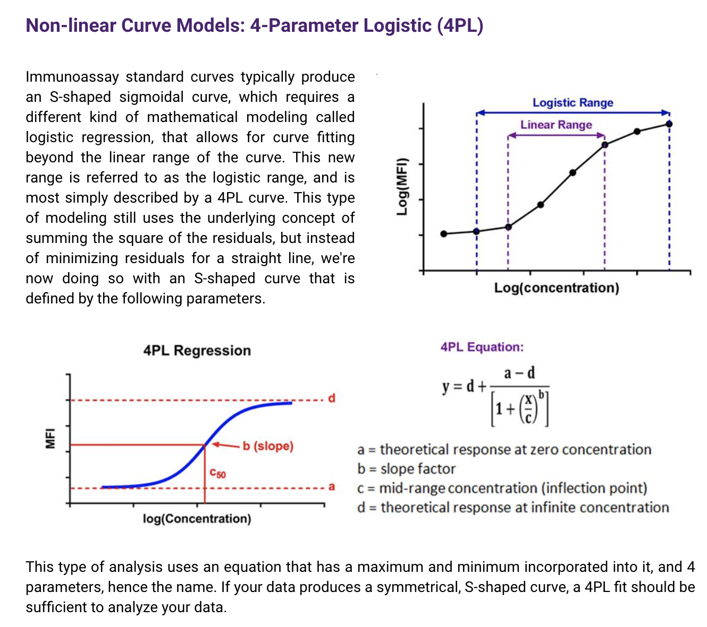
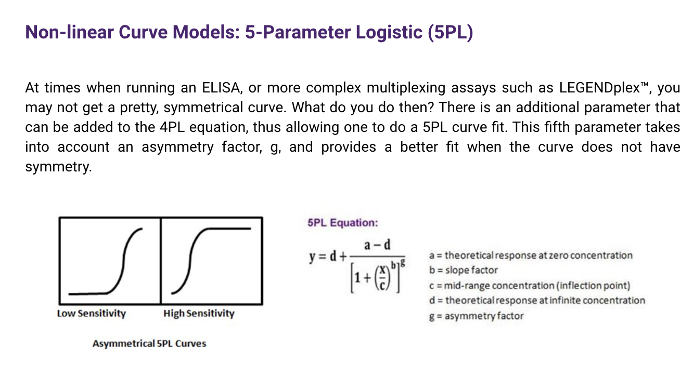
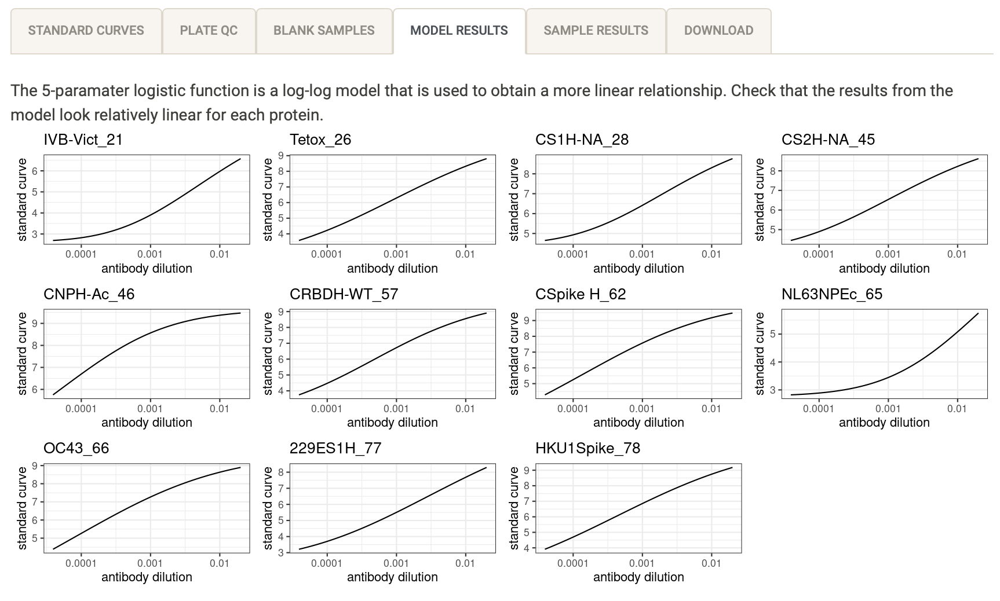

```{r setup, include=FALSE}
options(htmltools.dir.version = FALSE)
knitr::opts_chunk$set(
  fig.width=9, fig.height=3.5, fig.retina=3,
  out.width = "100%",
  cache = FALSE,
  echo = TRUE,
  message = FALSE, 
  warning = FALSE,
  hiline = TRUE
)


library(xaringanthemer)
library(xaringanExtra)
library(showtext)
library(fontawesome)
library(metathis)
library(countdown)
```

```{r xaringan-themer, include=FALSE, warning=FALSE}
style_duo_accent(
  primary_color = "#2372B9",
  secondary_color = "#174a79",
  inverse_header_color = "#FFFFFF",  
  header_color = "#2372B9", 
  code_highlight_color = "#93c54b",
  code_inline_color = "#93c54b",
  text_color = "#3d3d3d", 
  link_color = "#93c54b", 
  inverse_link_color =  "#93c54b",
  header_font_google = google_font("Roboto"),
  text_font_google   = google_font("News Cycle", "300", "300i"),
  code_font_google   = google_font("Fira Mono")
)
```

```{r xaringan-extras, echo=FALSE}
xaringanExtra::use_scribble()
xaringanExtra::use_panelset()
xaringanExtra::use_clipboard()
# xaringanExtra::use_share_again()
xaringanExtra::use_webcam()
xaringanExtra::use_broadcast()
# xaringanExtra::use_progress_bar(color = "blue", location = "bottom")
```

```{r metathis, echo=FALSE}
meta() %>%
  meta_name("github-repo" = "shaziaruybal/covidClassifyR-workshop/slides/session5") %>% 
  meta_social(
    title = "Session 5: How to perform quality control of your data using the covidClassifyR Shiny web application",
    description = paste(
      "A four-day workshop on how to use the covidClassifyR Shiny web application",
      "Created for researchers from the Papua New Guinea Institute of Medical Research and partner institutions"
    ),
    url = "https://shaziaruybal.github.io/covidClassifyR-workshop/slides/session5/session5_slides.html",
    image = "https://shaziaruybal.github.io/covidClassifyR-workshop/slides/session5/img/social-share-card.png",
    image_alt = paste(
      "Title slide of Session 5: How to perform quality control of your data using the covidClassifyR Shiny web application", 
      "created for researchers from the Papua New Guinea Institute of Medical Research and partner institutions"
    ),
    og_type = "website",
    og_author = "Shazia Ruybal-Pesántez",
    twitter_card_type = "summary_large_image",
    twitter_creator = "@DrShaziaRuybal",
    twitter_site = "@DrShaziaRuybal"
  )
```

class: title-slide, middle, left

## `r rmarkdown::metadata$title`

### `r rmarkdown::metadata$author`  
`r rmarkdown::metadata$institute`

`r rmarkdown::metadata$date`

---
class: left

# Recap

--

#### `r fontawesome::fa("check-square")` **[Session 1](https://shaziaruybal.github.io/covidClassifyR-workshop/sessions/2022-03-10-session1/index.html)** gave you an overview of the Luminex technology and the COVID-19 multi-antigen serological assay that was established in PNG

--

#### `r fontawesome::fa("check-square")` **Session 2** gave you an overview of the purpose of serosurveillance and insights into the COVID-19 sero-surveys that have been carried out in PNG 
--

#### `r fontawesome::fa("check-square")` **[Session 3](https://shaziaruybal.github.io/covidClassifyR-workshop/sessions/2022-03-10-session3/index.html)** gave you an overview of the [`covidClassifyR`](https://shaziaruybal.shinyapps.io/covidclassifyr) Shiny app

--

#### `r fontawesome::fa("check-square")` **[Session 4](https://shaziaruybal.github.io/covidClassifyR-workshop/sessions/2022-03-11-session4/index.html)** gave you an overview of how to prepare and import your data to the [`covidClassifyR`](https://shaziaruybal.shinyapps.io/covidclassifyr) Shiny app

--

.footnote[
For all the workshop materials see the [workshop website `r fontawesome::fa("external-link-alt")`](https://shaziaruybal.github.io/covidClassifyR-workshop/materials.html) 
]

---

class: center
# `r fontawesome::fa("chalkboard")`
# Today we will cover:

--
### How to perform quality control of your Luminex data

--
### How to interpet the QC plots

--

### You can find the app [here `r fontawesome::fa("external-link-alt")`](https://shaziaruybal.shinyapps.io/covidClassifyR)

---
class: inverse, middle, center

# `r fontawesome::fa("clipboard-check")`

## Quality control

--

### Note all of the plots in this interactive section will be downloaded in your QC report!

---

## Check your standard curves

.left-column[
The standard curve plots are generated from the antibody data from the standards you indicated in your plate layout (e.g. S1-S10) and median fluorescent intensity (MFI) units are displayed in log10-scale. 

Remember that there are 11 antigens in the COVID-19 assay panel, all of the COVID-19 antigens start with a "C". 

**`r fontawesome::fa("lightbulb")` Tip:** In general your standard curves should look relatively linear (only when the y-axis is on logarithmic scale).
]


.right-column[


]

---

# Check your plate bead counts

.left-column[
A summary of the bead counts for each plate well are displayed, with blue indicating there are sufficient beads (>15) or red when there are not enough. 

If any of the wells are red, they should be double-checked manually and re-run on a new plate if required.
]

.right-column[

]

---

# Check your blank samples

.left-column[
The median fluorescent intensity (MFI) units for each antigen is displayed for your blank samples. 

In general, each blank sample should have <50 MFI for each antigen, if they are higher they should be cross-checked manually. 

**`r fontawesome::fa("lightbulb")` Tip:** If you have more than one blank sample, make sure you label them differently in your plate layout (e.g. Blank1, Blank2), otherwise the figure will display cumulative MFI values for all your blank samples.
]


.right-column[

]

---
.pull-left[
## Automated curve fitting for our Luminex multiplex assay

The standard curve on each plate allows us to use the median fluorescence intensity (MFI) values recorded for each standard known concentration/dilution to estimate the antibody concentration for each unknown sample. 

When plotting the relationship between MFI and antibody concentration for our multiplex serological assay, it results in "S"-shaped curves, which is due to the non-linear relationship between MFI and antibody concentration. 

To account for the assymetry in this non-linear relationship, we can fit a logistic regression model using 4 parameters (4PL).  

.footenote[
.bottom[
_[Resource `r fontawesome::fa("external-link-alt")`](https://www.biolegend.com/en-us/blog/curve-fitting-for-immunoassays-legendplex)_
]]
]

.pull-right[

```{r echo=F, out.height=550, out.width=650}

```


]

---
.pull-left[
## Automated curve fitting for our Luminex multiplex assay

However, for more complex multiplex assays it is more appropriate to also account for the asymmetry to provide a better fit (by including the asymmetry factor). This is called a 5-parameter logistic (5PL) regression model.

.footnote[
.bottom[
_[Resource `r fontawesome::fa("external-link-alt")`](https://www.biolegend.com/en-us/blog/curve-fitting-for-immunoassays-legendplex)_
]]
]

.pull-right[

```{r echo=F, out.height=350, out.width=650}

```


]


---

# Check your model results

.left-column[
The automated data processing in this app allows you to convert your median fluorescence intensity (MFI) data into relative antibody units (RAU) by fitting a 5-parameter logistic (5PL) regression model to the standard curve on a per-antigen level. 

This log-log model is used to obtain a more linear relationship. 

**`r fontawesome::fa("lightbulb")` Tip:** In general your model results for each antigen should look relatively linear.
]

.right-column[

]

---

# Check the processed data

.left-column[
The results from the data processing are displayed in an interactive table within the app. The raw median fluorescent intensity (MFI) units and converted relative antibody units (RAU) are displayed for each antigen and for each sample. 

`r fa("check-square")` Scroll to the right to explore data for all antigens

`r fa("check-square")` Navigate to different pages to view all samples

`r fa("check-square")` Sort & filter as needed!
]

.right-column[


**`r fontawesome::fa("lightbulb")` Tip:** Check that the number of entries is as expected baed on the number of unknown samples in your plate layout and that RAU values have been calculated for all of your antigens.
]
---

# `r fa("laptop-code")` Demo

<video width="1330" height="410" controls>
  <source src="screen_records/qc_demo.mp4" type="video/mp4"> 
</video>

---

# Acknowledgments

- Dr Maria Ome-Kaius and Dr Fiona Angrisano
- PNGIMR and partner institutions
- WEHI & Burnet Institute
- All of you for attending! 

*We are extremely grateful for financial support to develop and host the covidClassifyR Shiny web application, and to host these virtual workshops through the [Regional Collaborations Programme COVID-19 Digital Grant](https://www.science.org.au/news-and-events/news-and-media-releases/regional-research-set-get-digital-boost) from the Australian Academy of Science and Australian Department of Industry, Science, Energy and Resources.*

The scripts and functions used in [`covidClassifyR`](https://shaziaruybal.shinyapps.io/covidclassifyr) were developed by Shazia Ruybal-Pesántez, with contributions from the following researchers: Eamon Conway, Connie Li Wan Suen, Narimane Nekkab and Michael White.


.footnote[
_These slides were created using the R packages:  
[xaringan](https://github.com/yihui/xaringan), 
[xaringanthemer](https://github.com/gadenbuie/xaringanthemer), 
[xaringanExtra](https://github.com/gadenbuie/xaringanExtra)_ 
]

---
name: contact
class: inverse

.pull-left[
.center[
### Dr Shazia Ruybal-Pesántez 


#### Contact details

[`r fa(name = "envelope")` ruybal.s@wehi.edu.au](mailto:ruybal.s@wehi.edu.au)  
[`r fa(name = "twitter")` @DrShaziaRuybal](https://twitter.com/DrShaziaRuybal)

]]

.pull-right[

### Session 5 Resources:

### [`r icon::fa("youtube")` Recording]()  
### [`r icon::fa("laptop-code")` `covidClassifyR`](https://shaziaruybal.shinyapps.io/covidClassifyR)  
### [`r fontawesome::fa("globe")` Workshop materials](https://shaziaruybal.github.io/covidClassifyR-workshop/materials.html)  
### [`r fontawesome::fa("image")` Slides for Session 5](https://shaziaruybal.github.io/covidClassifyR-workshop/slides/session5/session5_slides.html)
]


---
class: inverse, middle, center

# `r fa("question-circle")` Questions?