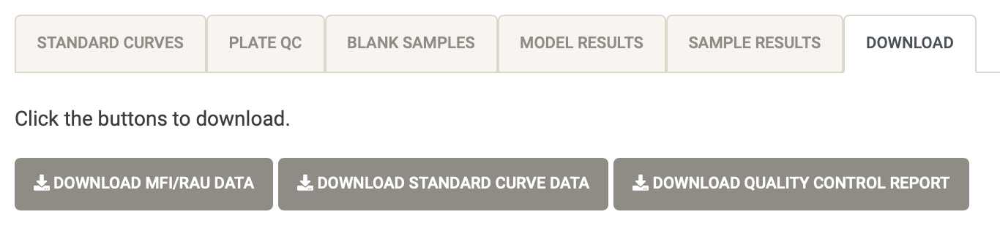
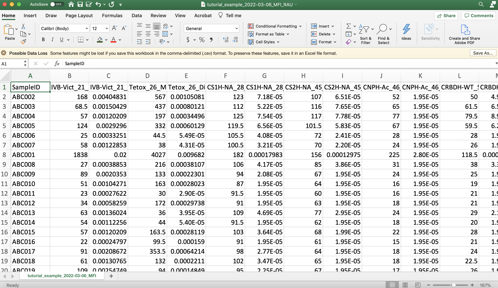
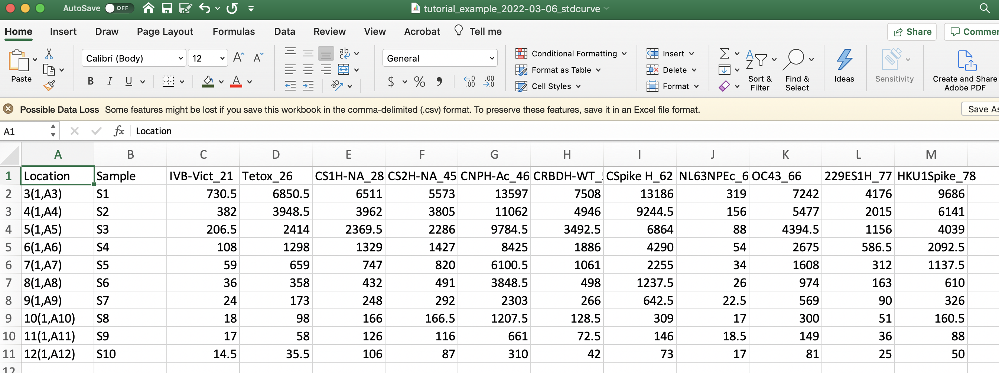
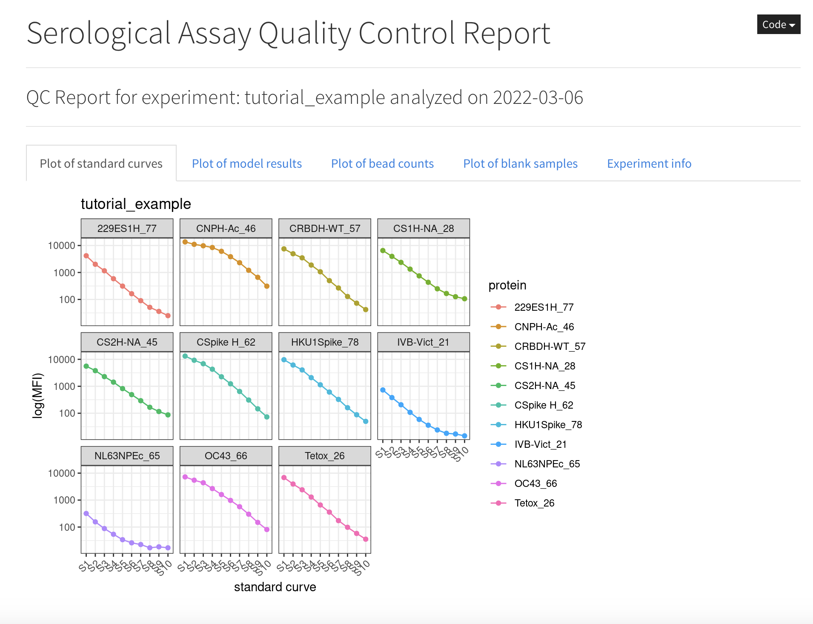

```{r setup, include=FALSE}
options(htmltools.dir.version = FALSE)
knitr::opts_chunk$set(
  fig.width=9, fig.height=3.5, fig.retina=3,
  out.width = "100%",
  cache = FALSE,
  echo = TRUE,
  message = FALSE, 
  warning = FALSE,
  hiline = TRUE
)


library(xaringanthemer)
library(xaringanExtra)
library(showtext)
library(fontawesome)
library(metathis)
library(countdown)
```

```{r xaringan-themer, include=FALSE, warning=FALSE}
style_duo_accent(
  primary_color = "#2372B9",
  secondary_color = "#174a79",
  inverse_header_color = "#FFFFFF",  
  header_color = "#2372B9", 
  code_highlight_color = "#93c54b",
  code_inline_color = "#93c54b",
  text_color = "#3d3d3d", 
  link_color = "#93c54b", 
  inverse_link_color =  "#93c54b",
  header_font_google = google_font("Roboto"),
  text_font_google   = google_font("News Cycle", "300", "300i"),
  code_font_google   = google_font("Fira Mono")
)
```

```{r xaringan-extras, echo=FALSE}
xaringanExtra::use_scribble()
xaringanExtra::use_panelset()
xaringanExtra::use_clipboard()
# xaringanExtra::use_share_again()
xaringanExtra::use_webcam()
xaringanExtra::use_broadcast()
# xaringanExtra::use_progress_bar(color = "blue", location = "bottom")
```

```{r metathis, echo=FALSE}
meta() %>%
  meta_name("github-repo" = "shaziaruybal/covidClassifyR-workshop/slides/session6") %>% 
  meta_social(
    title = "Session 6: Download your quality control report and processed data",
    description = paste(
      "A four-day workshop on how to use the covidClassifyR Shiny web application",
      "Created for researchers from the Papua New Guinea Institute of Medical Research and partner institutions"
    ),
    url = "https://shaziaruybal.github.io/covidClassifyR-workshop/slides/session6/session6_slides.html",
    image = "https://shaziaruybal.github.io/covidClassifyR-workshop/slides/session6/img/social-share-card.png",
    image_alt = paste(
      "Title slide of Session 6: Download your quality control report and processed data", 
      "created for researchers from the Papua New Guinea Institute of Medical Research and partner institutions"
    ),
    og_type = "website",
    og_author = "Shazia Ruybal-Pesántez",
    twitter_card_type = "summary_large_image",
    twitter_creator = "@DrShaziaRuybal",
    twitter_site = "@DrShaziaRuybal"
  )
```

class: title-slide, middle, left

## `r rmarkdown::metadata$title`

### `r rmarkdown::metadata$author`  
`r rmarkdown::metadata$institute`

`r rmarkdown::metadata$date`

---
class: left

# Recap

--

#### `r fontawesome::fa("check-square")` **[Session 1](https://shaziaruybal.github.io/covidClassifyR-workshop/sessions/2022-03-10-session1/index.html)** gave you an overview of the Luminex technology and the COVID-19 multi-antigen serological assay that was established in PNG

--

#### `r fontawesome::fa("check-square")` **Session 2** gave you an overview of the purpose of serosurveillance and insights into the COVID-19 sero-surveys that have been carried out in PNG 
--

#### `r fontawesome::fa("check-square")` **[Session 3](https://shaziaruybal.github.io/covidClassifyR-workshop/sessions/2022-03-10-session3/index.html)** gave you an overview of the [`covidClassifyR`](https://shaziaruybal.shinyapps.io/covidclassifyr) Shiny app

--

#### `r fontawesome::fa("check-square")` **[Session 4](https://shaziaruybal.github.io/covidClassifyR-workshop/sessions/2022-03-11-session4/index.html)** gave you an overview of how to prepare and import your data to the [`covidClassifyR`](https://shaziaruybal.shinyapps.io/covidclassifyr) Shiny app

--

#### `r fontawesome::fa("check-square")` **[Session 5](https://shaziaruybal.github.io/covidClassifyR-workshop/sessions/2022-03-11-session5/index.html)** gave you an overview of how to prepare your data and upload your data to the [`covidClassifyR`](https://shaziaruybal.shinyapps.io/covidclassifyr) app, and how to check the Luminex run info, raw data file and user-supplied plate layout

--

.footnote[
For all the workshop materials see the [workshop website `r fontawesome::fa("external-link-alt")`](https://shaziaruybal.github.io/covidClassifyR-workshop/materials.html) 
]

---

class: center
# `r fontawesome::fa("chalkboard")`
# Today we will cover:

--
### How to download your processed data

--
### How to download and interpret your QC report

--

### You can find the app [here `r fontawesome::fa("external-link-alt")`](https://shaziaruybal.shinyapps.io/covidClassifyR)

---
class: inverse, center, middle

# `r fontawesome::fa("download")`

## Downloading your data

--

#### The example output data can be downloaded [here `r fontawesome::fa("external-link-alt")`](https://shaziaruybal.shinyapps.io/covidClassifyR/_w_8c7cb1cd/output_tutorial.zip)

---

## `r fontawesome::fa("download")` Downloading your data

.panelset.sideways[

.panel[.panel-name[Download tab]


]

.panel[.panel-name[Processed MFI/RAU data]

.left-column[
You can download your processed data by clicking on the button “Download MFI/RAU data”. 

This will be a .csv file of the antigen-specific MFI and RAU ("Dilution") values for each sample. This file is the same as the table in the "Sample results" tab. 
]

.right-column[

]
]

.panel[.panel-name[Standard curve data]

.left-column[
In some cases it may be useful to compare your standard curve data across multiple plate runs, so you can also download the standard curve data separately by clicking the button “Download standard curve data”. 

This will be a .csv file of the antigen-specific MFI values for each standard sample (unprocessed). 
]

.right-column[

]
]

.panel[.panel-name[Quality control report]

.left-column[
You can download your quality control report, which includes all of the plots in the Quality control tab as well as the information you entered in the Import data tab (i.e. experiment name, notes, date and uploaded files).

**`r fontawesome::fa("lightbulb")` Tip:** The QC report is an .html file and is best viewed on a computer browser.

]

.right-column[


]
]

]

---

# `r fa("x-ray")` The anatomy of the QC report

<video width="1330" height="410" controls>
  <source src="img/qc_report.mp4" type="video/mp4"> 
</video>

---
# `r fontawesome::fa("book-open")` Your homework for next time

--

### `r fontawesome::fa("check-square")` Download the [example raw data `r fontawesome::fa("external-link-alt")`](https://shaziaruybal.shinyapps.io/covidClassifyR/_w_8c7cb1cd/example_data.zip) if you haven't already

--

### `r fontawesome::fa("check-square")` If you haven't already, import the raw data and plate layout and go through the QC 

--

### `r fontawesome::fa("check-square")` Download the [example output data `r fontawesome::fa("external-link-alt")`](https://shaziaruybal.shinyapps.io/covidClassifyR/_w_8c7cb1cd/output_tutorial.zip) for the next session

--
#### `r fontawesome::fa("star")` Bonus: try changing the experiment info, date and notes and download the processed data and QC

---
class: inverse, middle, center

# `r fontawesome::fa("clipboard-check")`

## Next session:

### Introduction to the classification algorithm

---

# Acknowledgments

- Dr Maria Ome-Kaius and Dr Fiona Angrisano
- PNGIMR and partner institutions
- WEHI & Burnet Institute
- All of you for attending! 

*We are extremely grateful for financial support to develop and host the covidClassifyR Shiny web application, and to host these virtual workshops through the [Regional Collaborations Programme COVID-19 Digital Grant](https://www.science.org.au/news-and-events/news-and-media-releases/regional-research-set-get-digital-boost) from the Australian Academy of Science and Australian Department of Industry, Science, Energy and Resources.*

The scripts and functions used in [`covidClassifyR`](https://shaziaruybal.shinyapps.io/covidclassifyr) were developed by Shazia Ruybal-Pesántez, with contributions from the following researchers: Eamon Conway, Connie Li Wan Suen, Narimane Nekkab and Michael White.


.footnote[
_These slides were created using the R packages:  
[xaringan](https://github.com/yihui/xaringan), 
[xaringanthemer](https://github.com/gadenbuie/xaringanthemer), 
[xaringanExtra](https://github.com/gadenbuie/xaringanExtra)_ 
]

---
name: contact
class: inverse

.pull-left[
.center[
### Dr Shazia Ruybal-Pesántez 


#### Contact details

[`r fa(name = "envelope")` ruybal.s@wehi.edu.au](mailto:ruybal.s@wehi.edu.au)  
[`r fa(name = "twitter")` @DrShaziaRuybal](https://twitter.com/DrShaziaRuybal)

]]

.pull-right[

### Session 6 Resources:

### [`r icon::fa("youtube")` Recording](https://youtu.be/qCXLwPhXbA8)  
### [`r icon::fa("laptop-code")` `covidClassifyR`](https://shaziaruybal.shinyapps.io/covidClassifyR)  
### [`r fontawesome::fa("globe")` Workshop materials](https://shaziaruybal.github.io/covidClassifyR-workshop/materials.html)  
### [`r fontawesome::fa("image")` Slides for Session 6](https://shaziaruybal.github.io/covidClassifyR-workshop/slides/session6/session6_slides.html)
]


---
class: inverse, middle, center

# `r fa("question-circle")` Questions?