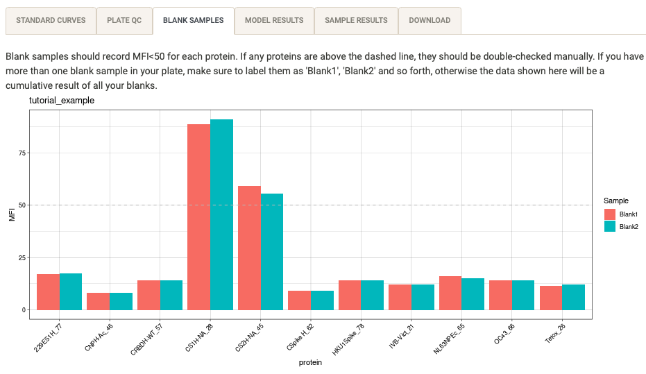
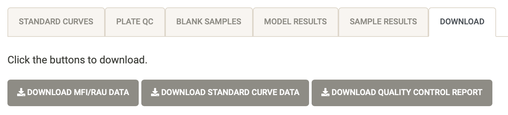

```{r setup, include=FALSE}
options(htmltools.dir.version = FALSE)
knitr::opts_chunk$set(
  fig.width=9, fig.height=3.5, fig.retina=3,
  out.width = "100%",
  cache = FALSE,
  echo = TRUE,
  message = FALSE, 
  warning = FALSE,
  hiline = TRUE
)


library(xaringanthemer)
library(xaringanExtra)
library(showtext)
library(fontawesome)
library(metathis)
library(countdown)
```

```{r xaringan-themer, include=FALSE, warning=FALSE}
style_duo_accent(
  primary_color = "#2372B9",
  secondary_color = "#174a79",
  inverse_header_color = "#FFFFFF",  
  header_color = "#2372B9", 
  code_highlight_color = "#93c54b",
  code_inline_color = "#93c54b",
  text_color = "#3d3d3d", 
  link_color = "#93c54b", 
  inverse_link_color =  "#93c54b",
  header_font_google = google_font("Roboto"),
  text_font_google   = google_font("News Cycle", "300", "300i"),
  code_font_google   = google_font("Fira Mono")
)
```

```{r xaringan-extras, echo=FALSE}
xaringanExtra::use_scribble()
xaringanExtra::use_panelset()
xaringanExtra::use_clipboard()
# xaringanExtra::use_share_again()
xaringanExtra::use_webcam()
xaringanExtra::use_broadcast()
# xaringanExtra::use_progress_bar(color = "blue", location = "bottom")
```

```{r metathis, echo=FALSE}
meta() %>%
  meta_name("github-repo" = "shaziaruybal/covidClassifyR-workshop/slides/session7") %>% 
  meta_social(
    title = "Session 7: Recap of how to perform quality control of your data",
    description = paste(
      "A four-day workshop on how to use the covidClassifyR Shiny web application",
      "Created for researchers from the Papua New Guinea Institute of Medical Research and partner institutions"
    ),
    url = "https://shaziaruybal.github.io/covidClassifyR-workshop/slides/session7/session7_slides.html",
    image = "https://shaziaruybal.github.io/covidClassifyR-workshop/slides/session7/img/social-share-card.png",
    image_alt = paste(
      "Title slide of Session 7: Recap of how to perform quality control of your data", 
      "created for researchers from the Papua New Guinea Institute of Medical Research and partner institutions"
    ),
    og_type = "website",
    og_author = "Shazia Ruybal-Pesántez",
    twitter_card_type = "summary_large_image",
    twitter_creator = "@DrShaziaRuybal",
    twitter_site = "@DrShaziaRuybal"
  )
```

class: title-slide, middle, left

## `r rmarkdown::metadata$title`

### `r rmarkdown::metadata$author`  
`r rmarkdown::metadata$institute`

`r rmarkdown::metadata$date`

---
class: left

# Recap

--

#### `r fontawesome::fa("check-square")` **[Session 1](https://shaziaruybal.github.io/covidClassifyR-workshop/sessions/2022-03-10-session1/index.html)** gave you an overview of the Luminex technology and the COVID-19 multi-antigen serological assay that was established in PNG

--

#### `r fontawesome::fa("check-square")` **Session 2** gave you an overview of the purpose of serosurveillance and insights into the COVID-19 sero-surveys that have been carried out in PNG 
--

#### `r fontawesome::fa("check-square")` **[Session 3](https://shaziaruybal.github.io/covidClassifyR-workshop/sessions/2022-03-10-session3/index.html)** gave you an overview of the [`covidClassifyR`](https://shaziaruybal.shinyapps.io/covidclassifyr) Shiny app

--

#### `r fontawesome::fa("check-square")` **[Session 4](https://shaziaruybal.github.io/covidClassifyR-workshop/sessions/2022-03-11-session4/index.html)** gave you an overview of how to prepare and import your data to the [`covidClassifyR`](https://shaziaruybal.shinyapps.io/covidclassifyr) Shiny app

--

#### `r fontawesome::fa("check-square")` **[Session 5](https://shaziaruybal.github.io/covidClassifyR-workshop/sessions/2022-03-11-session5/index.html)** gave you an overview of how to prepare your data and upload your data to the [`covidClassifyR`](https://shaziaruybal.shinyapps.io/covidclassifyr) app, and how to check the Luminex run info, raw data file and user-supplied plate layout

--

#### `r fontawesome::fa("check-square")` **[Session 6](https://shaziaruybal.github.io/covidClassifyR-workshop/sessions/2022-03-11-session6/index.html)** gave you an overview of how to download your processed data and quality control report

--

.footnote[
For all the workshop materials see the [workshop website `r fontawesome::fa("external-link-alt")`](https://shaziaruybal.github.io/covidClassifyR-workshop/materials.html) 
]

---

class: center
# `r fontawesome::fa("chalkboard")`
# Today we will cover:

--
### A brief recap of how to perform quality control of your data

--
### How to download your processed data and QC report

--

### You can find the app [here `r fontawesome::fa("external-link-alt")`](https://shaziaruybal.shinyapps.io/covidClassifyR)

---

# `r fa("book-open")` Feedback

--

### `r fa("question-circle")` Did you download the example data and practice importing it to the [covidClassifyR `r fontawesome::fa("external-link-alt")`](https://shaziaruybal.shinyapps.io/covidClassifyR)?

--

### `r fa("question-circle")` Did you go through the quality control section of the [covidClassifyR `r fontawesome::fa("external-link-alt")`](https://shaziaruybal.shinyapps.io/covidClassifyR)?

--

### `r fa("question-circle")` Did you download the example output data [covidClassifyR `r fontawesome::fa("external-link-alt")`](https://shaziaruybal.shinyapps.io/covidClassifyR)?

---

# `r fontawesome::fa("clipboard-check")` Quality control of your data: recap

--

#### `r fa("question-circle")` What do you expect your standard curves to look like?

--

```{r echo=F, out.height=500, out.width=900}
knitr::include_graphics("img/std_curves.png")
```

---

# `r fontawesome::fa("clipboard-check")` Quality control of your data: recap

--

#### `r fa("question-circle")` What do you expect your bead counts to be to indicate a "good run"?

--
```{r echo=F, out.height=400, out.width=800}
knitr::include_graphics("img/plate_qc.png")
```

---

# `r fontawesome::fa("clipboard-check")` Quality control of your data: recap

--

#### `r fa("question-circle")` What MFI do you expect your blank samples to be at to indicate a "good run"?

--
```{r echo=F, out.height=400, out.width=800}

```

---

# `r fontawesome::fa("clipboard-check")` Quality control of your data: recap

--

#### `r fa("question-circle")` What kind of model do we use to convert our data from MFI to RAU?

--
```{r echo=F, out.height=400, out.width=800}
knitr::include_graphics("img/model.png")
```

---

# `r fontawesome::fa("clipboard-check")` Quality control of your data: recap

--

#### `r fa("question-circle")` What do we expect in our processed data?

--
```{r echo=F, out.height=400, out.width=900}

```

---

## `r fontawesome::fa("download")` Downloading your data: recap

--


--
### _`r fa("question-circle")` What do we download if we click on "Download MFI/RAU data"?_

---
background-image: url(img/eg_MFIRAU.png)
background-position: bottom center
background-size: 75%

### `r fa("file-excel")` Processed MFI/RAU data output

---

## `r fontawesome::fa("download")` Downloading your data: recap


--
### _`r fa("question-circle")` What do we download if we click on "Download standard curve data"_

---
background-image: url(img/eg_std.png)
background-position: middle center
background-size: 75%

### `r fa("file-excel")` Standard curve data output

---

## `r fontawesome::fa("download")` Downloading your data: recap


--
### _`r fa("question-circle")` What do we download if we click on "Download quality control report"_

---
background-image: url(img/eg_report.png)
background-position: right center
background-size: 75%

.left-column[
### `r fa("file-excel")` Quality control report output
]

---
class: inverse, middle, center

# `r fontawesome::fa("clipboard-check")`

## Next session:

### Introduction to the classification algorithm

---

# Acknowledgments

- Dr Maria Ome-Kaius and Dr Fiona Angrisano
- PNGIMR and partner institutions
- WEHI & Burnet Institute
- All of you for attending! 

*We are extremely grateful for financial support to develop and host the covidClassifyR Shiny web application, and to host these virtual workshops through the [Regional Collaborations Programme COVID-19 Digital Grant](https://www.science.org.au/news-and-events/news-and-media-releases/regional-research-set-get-digital-boost) from the Australian Academy of Science and Australian Department of Industry, Science, Energy and Resources.*

The scripts and functions used in [`covidClassifyR`](https://shaziaruybal.shinyapps.io/covidclassifyr) were developed by Shazia Ruybal-Pesántez, with contributions from the following researchers: Eamon Conway, Connie Li Wan Suen, Narimane Nekkab and Michael White.


.footnote[
_These slides were created using the R packages:  
[xaringan](https://github.com/yihui/xaringan), 
[xaringanthemer](https://github.com/gadenbuie/xaringanthemer), 
[xaringanExtra](https://github.com/gadenbuie/xaringanExtra)_ 
]

---
name: contact
class: inverse

.pull-left[
.center[
### Dr Shazia Ruybal-Pesántez 


#### Contact details

[`r fa(name = "envelope")` ruybal.s@wehi.edu.au](mailto:ruybal.s@wehi.edu.au)  
[`r fa(name = "twitter")` @DrShaziaRuybal](https://twitter.com/DrShaziaRuybal)

]]

.pull-right[

### Session 7 Resources:

### [`r icon::fa("youtube")` Recording]()  
### [`r icon::fa("laptop-code")` `covidClassifyR`](https://shaziaruybal.shinyapps.io/covidClassifyR)  
### [`r fontawesome::fa("globe")` Workshop materials](https://shaziaruybal.github.io/covidClassifyR-workshop/materials.html)  
### [`r fontawesome::fa("image")` Slides for Session 7](https://shaziaruybal.github.io/covidClassifyR-workshop/slides/session7/session7_slides.html)
]


---
class: inverse, middle, center

# `r fa("question-circle")` Questions?